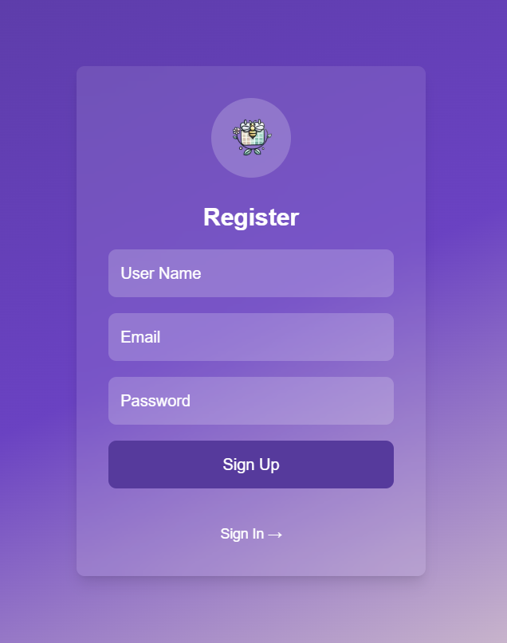
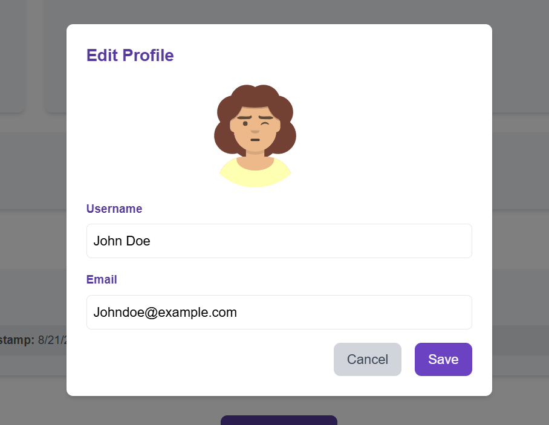
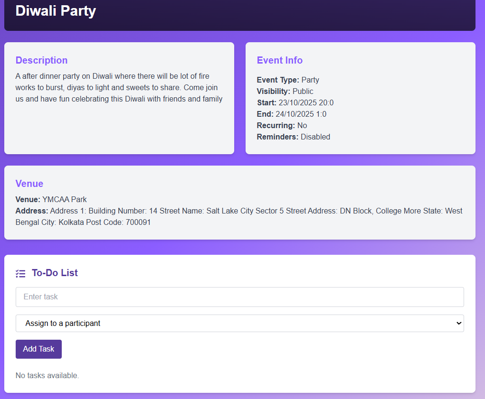
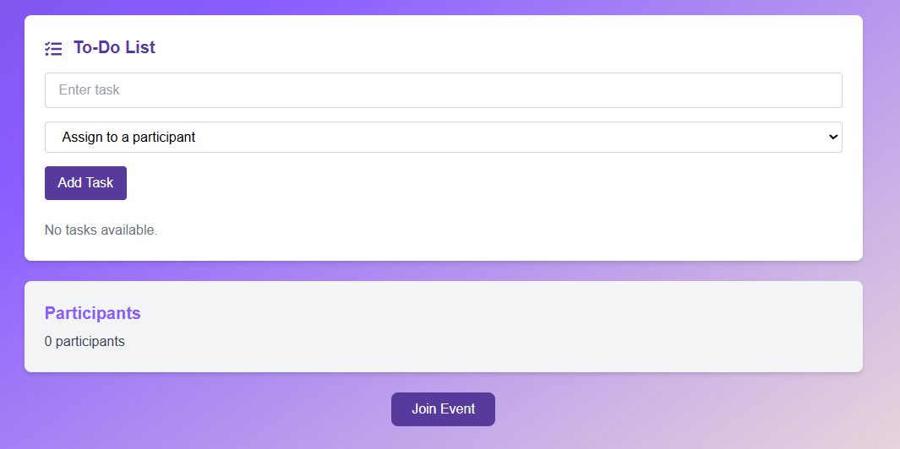

# EventHive 🎉

EventHive is the ultimate **collaborative event organizer** designed to help users create, manage, and enjoy events with **seamless participant management, real-time chats, task delegation, and calendar integration**.

---

## ✨ Features

* 📅 **Effortless Event Creation** – Create and customize events with details like name, description, schedule, venue, type, and cover image.
* 🤝 **Real-Time Collaboration** – Work with team members and participants seamlessly.
* 🗓️ **Calendar Integration** – Sync events for hassle-free planning.
* 💬 **Built-in Chatroom** – Quick communication with participants.
* 👥 **Participant Management** – Manage attendees effectively.
* 📊 **Activity Logs** – Keep track of recent updates and changes.
* ✅ **To-Do Lists** – Organize responsibilities with task delegation.

---

## 🖼️ Demo Screenshots

**Welcome Page**
The welcome screen introduces EventHive and allows users to sign in or sign up.

**Create New Event**

Users can create events with complete details and assign tasks with optional reminders.

**Event Details**
Events display description, information (type, visibility, recurrence, reminders), venue details, and an interactive to-do list.

**User Profile & Activity Logs**




View profile, event statistics (total, upcoming, completed events), and recent activity logs.

**Chatroom**

Collaborate and communicate with participants in real-time.

---

## 🚀 Getting Started

### 1. Clone the repository

```bash
git clone https://github.com/KierthanaRS/EventHive.git
cd EventHive
```

### 2. Install dependencies

#### Client

```bash
cd client
npm install
```

#### Server

```bash
cd ../server
npm install
```

### 3. Run the development servers

#### Client

```bash
cd client
npm run dev
```

#### Server

```bash
cd server
npm start
```

The app will be available at: **[http://localhost:3000](http://localhost:3000)** 🎯

---

## 👩‍💻 Usage

* Sign up or sign in to your EventHive account.
* Create and customize new events.
* Assign tasks to participants using the integrated To-Do List.
* View event stats and activity logs from your profile.
* Collaborate and communicate with participants in real time.

---

## 🛠️ Technologies Used

* **Frontend:** Next.js (React), Tailwind CSS
* **Backend:** Node.js, Express
* **Database:** MongoDB
* **Authentication:** JWT / Passport.js (if used)
* **Other Integrations:** Calendar API

---

## 📂 Folder Structure

```
EventHive/
│
├── client/              # Frontend (Next.js + Tailwind CSS)
│   └── src/             # Components, pages, utils
│
├── server/              # Backend (Node.js + Express)
    └── routes/          # API routes
    └── models/          # Database models (MongoDB)

```

---